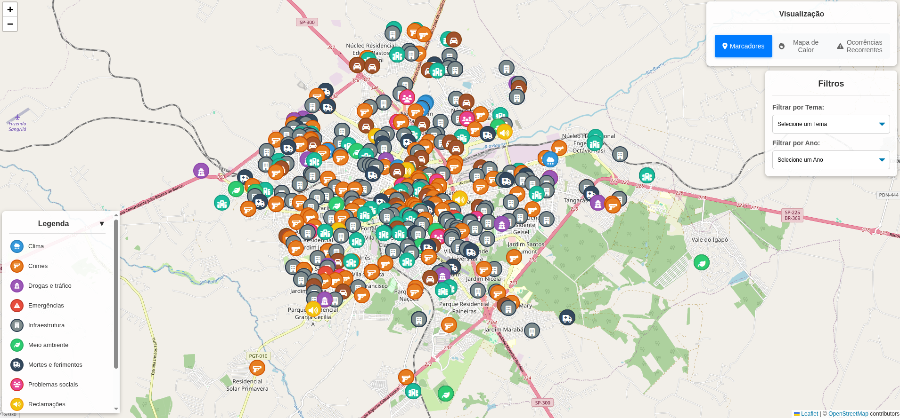

# Smart Bauru
Um Sistema de Informação Geográfica (SIG) para mapeamento e análise de ocorrências urbanas na cidade de Bauru–SP



## Tecnologias Utilizadas
- Backend: Python, Flask
- Frontend: HTML, CSS, JavaScript, Leaflet.js
- Banco de Dados: CSV

## Funcionalidades
- Mapeamento de ocorrências urbanas
- Visualização com marcadores, mapa de calor, pontos recorrentes ou dashboards
- Filtros por tipo de ocorrência e ano

Exemplo de validação com `curl`:

```bash
curl "http://localhost:5001/api/dashboard?ano=2024&tema=Clima"
```

## Instalação
1. Clone o repositório:
   ```bash
   git clone [https://github.com/f3l1pe-augusto/smart-bauru.git](https://github.com/f3l1pe-augusto/smart-bauru.git)
   cd smart-bauru
   ```
   
2. Crie um ambiente virtual e ative-o:
   ```bash
   python -m venv venv
   source venv/bin/activate  # No Windows use `venv\Scripts\activate`
   ```
   
3. Instale as dependências:
   ```bash
   pip install -r requirements.txt
   ```
   
4. Execute o backend:
   ```bash
   python app.py
   ```
5. Execute o servidor frontend (em outro terminal):
   ```bash
   python -m http.server
   ```

6. Acesse o sistema no navegador:
   ```
   http://localhost:8000
   ```
   
